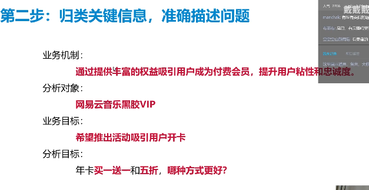
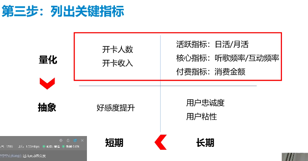
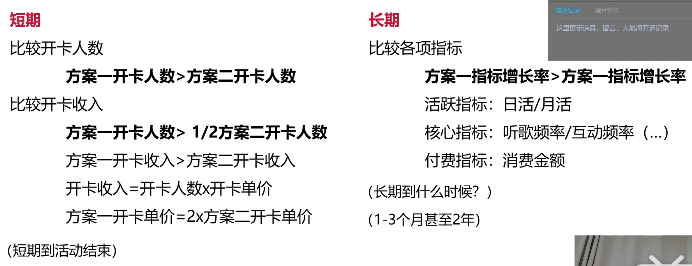
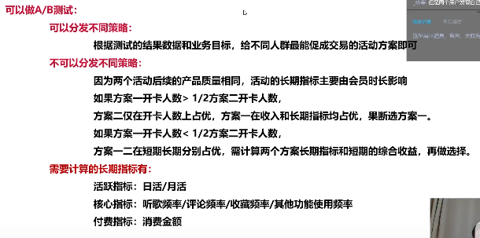

# 网易数据分析笔试
---
## 各大平台相继推出和迭代付费会员策略, 如优酷会员、京东PLUS会员、网易云音乐黑胶VIP等，通过提供丰富的权益吸引用户成为付费会员，提升用户粘性和忠诚度。请围绕付费会员回答以下问题：

### 1.以网易云音乐黑胶VIP为例，运营同学希望推出活动吸引用户开卡。一种方式是年卡买一送一，即支付一年的年费享受两年的会员权益；另一种方式是年卡费用五折。你认为哪一种方式更好？请给出具体的理由。

### 2. 网易云音乐和网易严选推出了联合会员，即购买云音乐的黑胶VIP，可以赠送一年的网易严选Pro会员。作为分析师，你将如何评估联合会员活动的成本收益？请给出具体的评估指标。

### 1.以网易云音乐黑胶VIP为例，运营同学希望推出活动吸引用户开卡。一种方式是年卡买一送一，即支付一年的年费享受两年的会员权益；另一种方式是年卡费用五折。你认为哪一种方式更好？请给出具体的理由。
---
### 第一二步：提取信息，归类关键问题，准确描述问题
思路： 如何拉新

业务机制：通过提供丰富的权益吸引用户成为付费会员，提升用户粘性和忠诚度。

分析对象：网银云音乐黑胶VIP

业务目标：希望推出活动吸引用户开卡

分析目标：年卡买一送一和五折，那种方式更好？ 给具体理由

---

（一定要给明确结论，最好可以量化和测量，只有量化指标才能更好的反映事实！！！）

不能：
① 讨论不总结：这个好在哪，那个好在哪
② 思考不全面：单方面比较两种方式的好处和坏处
③ 结论不量化：A情况怎样，纯文字描述完全没数字和公式
④ 指标不定义：说了比较用户数，但是没说用户数具体指哪个指标

### 第三步：列出关键指标（优先长期指标）
关键指标：
短期（到活动结束）：开卡人数
开卡人数/开卡收入

长期（1-3个月甚至2年）：长期增长率
活跃指标：日活/月活
核心指标：听歌频率/互动频率
付费指标：消费金额

### 第四步：将针对指标进行的比较量化成公式

### 第五步：分析出谁在影响我们比较的指标
短期指标影响因素：
人天然对ROI（投入产出比）不敏感，对绝对值敏感：
价格：价格越低，购买人数越多
时长：时长越高，购买人数越多

不同用户对不同的绝对值敏感度不同：
新用户：对价格更敏感
老用户：有信任感，对时长更敏感

长期指标影响因素:
产品质量：
两者都一样（并不是一个可供分析的影响因素）

会员时长：
时长越长，长期指标提升的概率就越大

### 第六步：总结影响因素和比较指标之间的关系
价格与购买人数：价格越低，购买人数越多
价格与长期指标：基本无关
时长与购买人数: 时长越长，购买人数越多
时长与长期指标：时长越长，长期指标表现的越好（价值锚定，长尾效应，有而且很大。）
新用户数与价格：新用户越多，价格越低，活动越有吸引力
老用户数与时长：老用户越多，时长越长，活动越有吸引力

### 第七步：考虑实践，根据影响因素分类讨论，给出结论

灰度发布：不对所有用户，只取小部分最想测试的，或者最有代表性的用户，提前进行测试。

可以做A/B测试or产品测试：用抽样数据实验做统计推断整体：

    可以分发不同的策略（用户分层和用户画像的实践，比如说主体数据库就是按主体用户建立的，那精细化的用户分层没有意义，特别是当不能采取不同分发策略的时候）：
    根据测试的结果数据和业务目标，给不同人群最能促成交易的活动方案即可（测试是最有效的）
---
    不可以分发不同策略（给不同用户不同的方案组合，微弱差别的策略分发）：
    因为两个活动后续的产品质量相同，活动的长期指标主要由会员时长影响。

    如果方案一开卡人数 ＞ 1/2方案二开卡人数
    方案二仅在开卡人数上占优，方案一在收入和长期指标均占优，果断方案一
    如果方案一开卡人数 ＜ 1/2方案二开卡人数
    方案一二在短期和长期分别占优，需要计算两
    个方案长期指标和短期的综合效益，再做选择

    需要计算的长期指标有：
    活跃指标：日活/月活
    核心指标：听歌频率/评论频率/收藏频率/其他功能使用频率
    付费指标：消费金额

不可以做A/B测试or产品测试：用抽样数据实验做统计推断整体：

    可以分发不同的策略：
    因为新用户对价格敏感，老用户有信任感，更对时长敏感，所以新用户5折，老用户买一送一

---

    不可以分发不同策略：
    根据APP现有的新老用户比例和活动曝光渠道用户画像预估新老用户比例，新用户比例高就5折，老用户比例高就买一送一

不管可不可以做AB测试：
都要可能把活动都做一次，在两年后复盘数据，重新分析活动并进行策略优化

## 作答：

先做AB测试，根据测试结果定活动方案，
核心比较反感一开卡人数是否大于方案二开卡人数的一半。
懒得做AB测试就新用户5折，老用户买一送一。
怕被骂大数据杀熟，直接买一送一，不要浪费时间
PS：早过增长期了，哪还有什么新用户，跟老用户好好过不就得了

