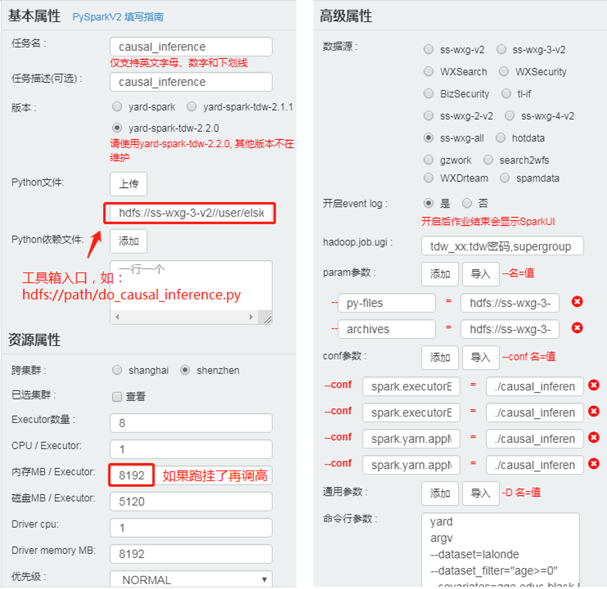

# 部署
因果推断工具包可以作为 PySpark 程序运行，因此可以在任何支持 PySpark 的平台上运行（如 Tesla 和 YARD）。

对于 WXG 的同学，推荐使用 Yard，配置过程中无需下载项目代码进行任何环境和代码的打包。

对于非 WXG 的同学，可以使用 Tesla。由于 Tesla 配置 Python 依赖时只能上传压缩包，不能填写 HDFS 地址，使用过程中需要下载项目后执行脚本打包依赖。

下面详细介绍部署流程。

## 在 Yard 上部署
本节介绍在 [Yard](http://yard.oa.com) 上部署与执行的方式。
- 以执行 `applications/do_causal_inference.py`为例；
- 可以直接使用打包好的环境和代码 `hdfs://ss-wxg-3-v2//user/elsielin/causal_inference/release/`（该环境在 x86 上编译，不支持 ppc 集群），如果想要自行打包请参考本文档最后一部分。

在 YARD 上新建一个工程，拖一个 PySparkV2 节点，如下配置：


1. 基本属性
在 Python 文件填入工具箱入口。
    ```
    hdfs://ss-wxg-3-v2//user/elsielin/causal_inference/release/do_causal_inference.py
    ```
2. 资源属性：如图
3. 高级属性
    - 在 `hadoop.job.ugi` 填上 TDW 帐号和密码，形如`tdw_名字:密码,supergroup`
    - param 参数
    ```
    --py-files=hdfs://ss-wxg-3-v2//user/elsielin/causal_inference/release/causal_inference.zip
    --archives=hdfs://ss-wxg-3-v2/user/elsielin/causal_inference/release/causal_inference_env.zip
    ```
    - conf 参数
    ```
    --conf spark.executorEnv.PYSPARK_PYTHON=./causal_inference_env/bin/python
    --conf spark.executorEnv.R_HOME=./causal_inference_env/lib/R
    --conf spark.yarn.appMasterEnv.PYSPARK_PYTHON=./causal_inference_env/bin/python
    --conf spark.yarn.appMasterEnv.R_HOME=./causal_inference_env/lib/R
    ```
    - 算法参数根据具体任务配置填写，例如（需替换 TDW 帐号和密码）：
    ```
    yard argv --dataset=lalonde --dataset_filter="age>=0" --covariates=age,educ,black,hispan,married,re75 --treat=treat --outcomes=re78 --tdw_username=tdw_xxx --tdw_password=xxx
    ```

完成上述流程后即可直接运行。运行结果和错误信息在“详情-AM日志-spark.stdout”和“详情-AM日志-spark.stderr”中可查。如果问题，欢迎提 issue。

在 Yard 上使用因果推断工具包的其它常见问题：

- 如果“提交失败”，报错 “Permission denied: user=tdw_xxxx, access=WRITE, inode=\"/user/tdw_xxxx\":hdfsadmin:supergroup:drwxr-xr-x”（可能出现在首次使用 Yard 时），可在 conf 参数内加上以下配置：
    ```
    --conf spark.sql.warehouse.dir=hdfs://ss-wxg-3-v2/tmp/spark
    --conf spark.yarn.stagingDir=hdfs://ss-wxg-3-v2/tmp/spark
    ```


## 在 Tesla 上部署
本节介绍在 [Tesla](http://tesla.oa.com) 上部署与执行的方式。
- 以执行 `applications/do_causal_inference.py` 为例；
- 假设准备的环境在 `hdfs://ss-wxg-3-v2//user/elsielin/causal_inference/release/`（该环境在 x86 上编译，不支持 ppc 集群），如果想要自行打包请参考本文档最后一部分。

下载项目代码，进入项目根目录，打包 Python 依赖：
1. 方法一：使用脚本打包
```
mkdir -p dist
./scripts/make_dist
```
2. 方法二：手工打包 `项目根目录/causal_inference`为`dist/causal_inference.zip`，有几个注意点：
    - 压缩项目根目录下的`causal_inference`文件夹（和`applications`同级），不要压缩整个项目根目录；
    - 压缩后，打开压缩包检查一下，压缩包里应该是`causal_inference`文件夹，文件夹内是`__init__.py`和其它文件。

在 Tesla 上新建一个工作流，拖一个 PySpark 节点，如下配置：
1. 组件参数：
    - 执行脚本：上传项目代码 `applications/do_causal_inference.py`
    - 依赖包文件：上传打包好的 Python 依赖 `dist/causal_inference.zip`
    - 算法参数根据具体任务配置填写，例如：`tesla argv --dataset=lalonde --covariates=age,educ,black,hispan,married,re75 --dataset_filter=age>=0  --treat=treat --outcomes=re78`
2. 资源参数：
    - num-executors: 8
    - driver-memory(g): 8
    - executor-cores: 1
    - executor-memory(g): 8（如果内存不足，需要再调高）
    - spark-conf
      ```
      spark.yarn.dist.archives=hdfs://ss-wxg-3-v2/user/elsielin/causal_inference/release/causal_inference_env.zip#venv
      spark.executorEnv.PYSPARK_PYTHON=./venv/causal_inference_env/bin/python
      spark.executorEnv.R_HOME=./venv/causal_inference_env/lib/R
      spark.yarn.appMasterEnv.PYSPARK_PYTHON=./venv/causal_inference_env/bin/python
      spark.yarn.appMasterEnv.R_HOME=./venv/causal_inference_env/lib/R
      ```
3. 特殊参数：
    - 集群：如果使用 `hdfs://ss-wxg-3-v2/user/elsielin/causal_inference/release/causal_inference_env.zip`，不要选择带有 “PPC” 的集群
	- Spark 版本：tdw 3.11-2.2.x
	- 动态资源分配：关闭

完成上述流程后即可直接运行。运行结果在“spark.stdout”，错误信息在“spark.stderr”可查。如果问题，欢迎提 issue。

附上 Tesla 查看日志方法：
1. 在节点上点右键-Spark控制台
2. 在节点上点右键-日志信息-查看日志-Spark详细日志-AM日志


## 自行打包环境和代码到 HDFS
步骤如下：
1. 准备一台能连外网、有 Python 和 conda 的机器（Anaconda 或 Miniconda）。
2. 准备和打包环境
   ```bash
   cd causal_inference  # 进入项目目录
   bash setup_environment.sh  # 准备 conda 环境
   mkdir -p dist  # 准备存放打包环境和代码的目录
   zip -rq ./dist/causal_inference_env.zip causal_inference_env/ # 打包
   ```
3. 打包代码
   ```bash
   ./scripts/make_dist # 打包
   ```
4. 上传环境和代码到 HDFS
   ```bash
   hadoop fs -put ./dist/causal_inference_env.zip hdfs://path/ # 环境
   hadoop fs -put ./dist/causal_inference.zip hdfs://path/ # causalinference库
   hadoop fs -put applications/*.py hdfs://path/ # 工具包入口代码
   ```

Windows 打包过程中可能会遇到的问题：

1. 准备环境时，如果路径带有中文，`setup_enviroment.sh` 中的 `cat ${conda_env_yml}` 有可能会卡住，可以注释掉。
2. 如果 Git Bash （或其它）的 Conda 是新安装的，可能需要先自行 `conda init` 一下再执行 `setup_environment.sh`。

