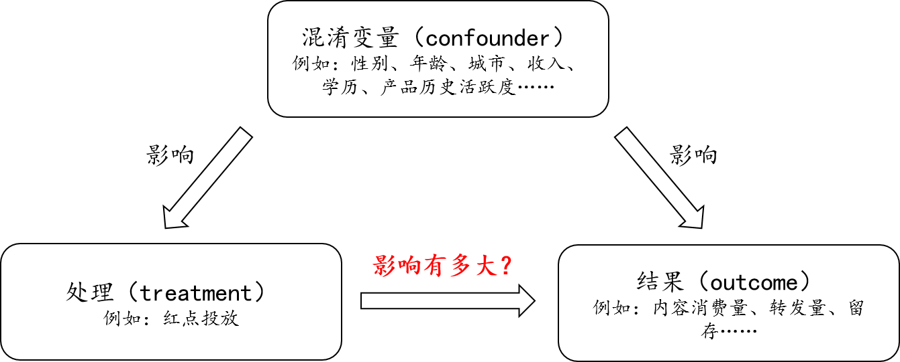

# “模拟A/B Test”工具箱的使用

【文档目录】

- 适用场景：详细描述了工具箱的适用场景

- 示范案例：通过一个详细的例子介绍工具箱的使用流程
- 算法介绍：汇总了工具箱中集成的所有算法
- 参数介绍：详细介绍各参数的配置方式
- 使用 Tips

## 适用场景

直观来看，下图描述了“模拟 A/B Test”工具箱适用的场景。



更多例子如下：
1. 红点投放对用户内容消费和次日留存有多大提升？
	- 输入数据：
       - 处理变量（treatment）：当天是否有红点投放；
       - 结果变量（outcome）：当天的内容消费和转发情况，第二天的留存情况；
       - 混淆变量（confounder）：性别、年龄、城市、各类历史活跃度（如内容消费、转发、30天访问天数）等。
    - 输出因果效应：
       - ATE（Average Treatment Effect）：对于**所有**用户，比较投放红点和没有投放红点的两个平行世界，他们每个结果变量的变化如何，即红点对于这些结果变量的影响。
       - ATT（Average Treatment Effect on the Treated）：对于**红点投放**用户，比较投放红点和没有投放红点的两个平行世界，他们每个结果变量的变化如何，即红点对于这些结果变量的影响。
       - ATC（Average Treatment Effect on the Control）：对于**非红点投放**用户，比较投放红点和没有投放红点的两个平行世界，他们每个结果变量的变化如何，即红点对于这些结果变量的影响。
       - 建议根据需求和数据情况决定跑哪一种因果效应。
2. 广告投放对商品购买有多大促进效果？
	- 输入数据：
       - 处理变量（treatment）：当天是否被投放了广告；
       - 结果变量（outcome）：广告对应商品的点击/转化/消费情况；
       - 混淆变量（confounder）：性别、年龄、城市、收入等级、历史广告效果、购买兴趣等。
    - 输出因果效应：
   		- ATE/ATT/ATC：对于**所有/广告投放/非广告投放**用户，比较投放广告和无广告投放的两个平行世界，每个结果变量的变化如何？
3. 就业培训能否带来收入提升？
	- 输入数据：
       - 处理变量（treatment）：是否接受就业培训；
       - 结果变量（outcome）：1978年的收入；
       - 混淆变量（confounder）：年龄、教育年限、是否为黑人、是否为西班牙裔、是否结婚、是否有高中及以上学历 、1974年和1975年的收入（提供培训前）。
    - 输出因果效应：
   		- ATE/ATT/ATC：对于**所有/接受就业培训/无就业培训**的人，比较接受就业培训和未参加就业培训的两个平行世界，每个结果变量的变化如何？

### 双重差分模型（difference-in-differences）

当能够收集处理生效前（例如红点投放前）的数据时，可以借鉴**双重差分模型（difference-in-differences）**的思路处理结果数据，举例如下：
1. 红点投放对用户内容消费和次日留存有多大提升？
    - 结果变量：当天的内容消费/转发情况相比于上一周期的变化，第二天的留存相比于上一周期的变化。
2. 广告投放对商品购买有多大促进效果？
    - 结果变量：广告对应商品的点击/转化/消费情况相比于上一周期的变化。
3. 就业培训能否带来收入提升？
	- 结果变量：1978年的收入相比于1975年收入的变化。

更多关于因果推断的介绍，例如潜在结果模型的定义和因果效应的可识别性，见KM文章[《因果推断简介（一）：掀开“因果推断”的面纱》](http://km.oa.com/group/18398/articles/show/367081)。

## 示范样例

这部分旨在通过一个因果推断经典案例，介绍如何使用因果推断完成一个完整的案例分析。

### 问题定义

问题定义：参与就业培训对收入有什么影响？

### 数据准备

数据需要包含三部分：

1. 处理（treatment）：目前仅支持二值的 treatment，即取值范围为{0,1}；如果 treatment 是连续值，需要根据具体场景，自行拆分成 {0,1}。
2. 结果（outcomes）：一个或者多个，如果有多个果如 outcome1、outcome2，我们将分别推断 treatment-outcome1 和 treatment-outcome2 的因果效应。
3. 用户变量（covariates）：**所有**需要控制两组用户同质的变量，推断的可靠程度取决于这个列表的齐全程度。对于“类别”类型的变量（如，城市）需要自行手工 one-hot 编码。

本案例使用一个经典的因果推断数据，共包含614个样本（614行）。

| 字段名   | 含义                         | 字段类型   |
| -------- | ---------------------------- | ---------- |
| treat    | 是否参加就业培训（处理变量） | treatment  |
| re78     | 1978年的收入（结果变量）     | outcome    |
| age      | 年龄                         | covariates |
| educ     | 教育年限                     | covariates |
| black    | 是否为黑人（0或1）           | covariates |
| hispan   | 是否为西班牙裔（0或1）       | covariates |
| married  | 是否结婚（0或1）             | covariates |
| nodegree | 是否有高中及以上学历（0或1） | covariates |
| re74     | 1974年的收入（实验前）                 | covariates |
| re75     | 1975年的收入（实验前）          | covariates |

数据集位置：

- https://git.oa.com/wechat-datagroup/causal_inference/blob/master/causal_inference/datasets/data/lalonde.csv

### 相关性分析

以 treat 分组进行一维统计分析结果如下。称 treat=1 的样本为“实验组”，treat=0 的样本为“对照组”。

从表中可以看出，实验组的 1978 年的收入（结果变量）比对照组低 635 美金。

但是，注意到实验组和对照组用户是很不一样的，例如实验组在实验前的年收入（re74和re75）也是远低于对照组的。因此直接比较这两组用户是没有意义的。

| 指标           | 实验组 | 对照组 | 差异（实验组-对照组） | 备注 |
| -------------- | ------ | ------ | --------------------- | --------------------- |
| avg(age)     | 25.8   | 28.0   | -2.21                 | |
| avg(educ)    | 10.4   | 10.2   | 0.11                  | |
| avg(black)   | 84%    | 20%    | 0.64                  | |
| avg(hispan)  | 6%     | 14%    | -0.08                 | |
| avg(married) | 19%    | 51%    | -0.32                 | |
| avg(nodegree) | 71%    | 1%     | 0.70                  | |
| avg(re74)    | 2096   | 5619   | -3523.00              |实验前实验组的收入也更低|
| avg(re75)    | 1532   | 2466   | -934.00               |实验前实验组的收入也更低|
| avg(re78)    | 6349   | 6984   | -635.00               |实验后实验组的收入低|
| 分组人数       | 185    | 429    | /                     | |

### 执行“模拟A/B Test”工具箱

我们使用“模拟 A/B Test”来回答“就业培训对收入有什么影响”这个问题。

1. 执行因果推断工具箱
	- 工具箱入口：`applications/do_causal_inference`
	- 在 Tesla 上使用：参照[部署文档](deploy.md)进行部署，用以下参数执行：
        ```
        tesla argv --dataset=lalonde --dataset_filter=age>=0 --covariates=age,educ,black,hispan,married,nodegree,re74,re75 --treat=treat --outcomes=re78
        ```
	- 在 Yard 上使用：参照[部署文档](deploy.md)进行部署并执行，用以下参数执行：
        ```
        yard argv --dataset=lalonde --dataset_filter='age>=0' --covariates=age,educ,black,hispan,married,nodegree,re74,re75 --treat=treat --outcomes=re78 --tdw_username=tdw_帐号 --tdw_password=密码
        ```
	- 在本地 PC 使用：参照[部署文档](deploy.md)安装并进入`conda`环境，在工程目录下用以下参数执行：
        ```
        PYTHONPATH='.' python ./applications/do_causal_inference.py local argv --dataset=lalonde --covariates=age,educ,black,hispan,married,nodegree,re74,re75 --dataset_filter='age>=0' --treat=treat --outcomes=re78
        ```
        如在 Windows 下，建议（1）在 `Git Bash` 或类似 Linux-like 的命令行下执行；（2）用 PyCharm 打开整个工程，通过 PyCharm 执行`applications/do_causal_inference`。如果其它各显神通的方法，欢迎提 Issue / Merge Requests。
	
2. 保存分析报告

   - 工具箱执行完毕后，分析报告打印在标准输出中。

     ```
     -------------------------------------------------------------
     Causal inference logs
     -------------------------------------------------------------
     报告从这里开始……
     ```

### 因果推断报告解读

因果推断报告分为以下几块，分别是：
1. 因果效应（标题：Average treatment effect table）
2. 各推断算法执行时间（标题：Running time）
3. 部分推断算法的中间结果（标题：More information of xxx）
4. 因果推断配置备忘（标题：Configuration）

#### 因果效应汇总

下表是各种不同推断方法的推断结果。具体方法介绍见“工具箱方法介绍”一节。可以看到大部分推断算法认为就业培训（treat）对收入（re78）是有提升作用的。但是这里由于样本量较小（数据集仅有614个样本），95%置信区间较大，提升并不显著。

对于 Propensity Score Matching 和各类 Weighting 方法，Remarks 这一列给出了匹配/加权后的处理组和对照组有较大差异（SMD>0.1）的混淆变量占比。这些方法详细的每个指标的差异见后续的详细日志“More information of xxx”。当某个方法有较大比例的指标差异很大时（见仁见智），建议不使用对应方法的推断结果。

对于 X-Learner 和 R-Learner，这两类方法内部包含机器学习组件 XGBClassifier 或 XGBRegressor，Remarks 这一列提示用户需要看后续的详细日志“More information of xxx”中打印的机器学习模型评估指标，通过判断拟合效果是否达到预期来判断是否采用这两个方法给出的结论（例如 R2>0.8, AUC>0.9，具体阈值见仁见智）。

| Outcome | Method                    | Estimand | Estimate | Std. Err. | Lower CI (95%) | Upper CI (95%) | Remarks                                                   |
| ------- | ------------------------- | -------- | -------- | --------- | -------------- | -------------- | --------------------------------------------------------- |
| re78    | BART                      | ATT      | 1393.2   | 854.6849  | -281.951       | 3068.352       |                                                           |
| re78    | BART + TMLE               | ATT      | 1369.503 | 849.3481  | -295.188       | 3034.195       |                                                           |
| re78    | BART on PScore            | ATT      | 1348.255 | 894.9332  | -405.782       | 3102.291       |                                                           |
| re78    | Causal Forest             | ATT      | 758.4929 | 952.0697  | -1107.56       | 2624.55        |                                                           |
| re78    | Propensity Score Matching | ATT      | 919.3179 | 932.3778  | -908.109       | 2746.745       | Unbalanced=12%                                            |
| re78    | Weighting (cbps)          | ATT      | 1244.272 | 822.4024  | -367.607       | 2856.151       | Unbalanced=0%                                             |
| re78    | Weighting (ec)            | ATT      | 1273.262 | 825.0589  | -343.824       | 2890.347       | Unbalanced=0%                                             |
| re78    | Weighting (optweight)     | ATT      | 1199.744 | 818.5179  | -404.522       | 2804.009       | Unbalanced=0%                                             |
| re78    | Weighting (ps)            | ATT      | 1052.705 | 980.159   | -868.372       | 2973.781       | Unbalanced=38%                                            |
| re78    | X-Learner       | ATT      | 189.315   | 111.163   | -30.003        | 408.634        | See "more information" for error   metrics of ML learners |
| re78    | M-Learner      | ATT      | 1755.007 | 2104.118 | -2396.293     | 5906.307      | See "more information" for error   metrics of ML learners |


备注：

1. 随着工具箱的更新，最新版本工具箱的运行结果可能与上表有一定区别。
2. 多种方法的推断结论可结合起来一起看。

## 算法介绍

工具箱中集成了以下方法。

| 方法缩写                  | 方法全名                                                     | 介绍                                                         |
| ------------------------- | ------------------------------------------------------------ | ------------------------------------------------------------ |
| Propensity Score Matching | Propensity Score Matching                                    | [因果推断简介（二）：倾向性得分匹配介绍](http://km.oa.com/articles/view/395355) |
| Weighting (PS)            | Propensity Score Weighting                                   | [因果推断简介（三）：倾向性得分加权介绍](http://km.oa.com/articles/view/421639) [[R package]](https://cran.r-project.org/package=WeightIt) |
| Weighting (CBPS)          | Covariate Balancing Propensity Score Weighting               | [因果推断简介（三）：倾向性得分加权介绍](http://km.oa.com/articles/view/421639) [[R package]](https://cran.r-project.org/package=WeightIt) |
| Weighting (EC)            | Empirical Calibration                                        | [因果推断简介（三）：倾向性得分加权介绍](http://km.oa.com/articles/view/421639) [[Python package]](https://github.com/google/empirical_calibration) |
| Weighting (OptWeight)     | Targeted Stable Balancing Weights Using Optimization         | [因果推断简介（三）：倾向性得分加权介绍](http://km.oa.com/articles/view/421639) [[R package]](https://cran.r-project.org/package=WeightIt) |
| BART                      | Bayesian Additive Regression Trees                           | Chipman H A, George E I, McCulloch R E. BART: Bayesian additive regression trees[J]. The Annals of Applied Statistics, 2010, 4(1): 266-298. [[论文]](https://projecteuclid.org/euclid.aoas/1273584455)[[KM 的 BART 介绍文章]](http://km.oa.com/group/33288/articles/show/392855)[[R package]](https://cran.r-project.org/web/packages/BART/index.html) |
| BART + TMLE               | Bayesian Additive Regression Trees + Targeted Maximum Likelihood Estimation | Chipman H A, George E I, McCulloch R E. BART: Bayesian additive regression trees[J]. The Annals of Applied Statistics, 2010, 4(1): 266-298. [[论文]](https://projecteuclid.org/euclid.aoas/1273584455)[[R package]](https://cran.r-project.org/web/packages/BART/index.html) |
| BART + PScore             | Bayesian Additive Regression Trees + Propensity Score        | Chipman H A, George E I, McCulloch R E. BART: Bayesian additive regression trees[J]. The Annals of Applied Statistics, 2010, 4(1): 266-298. [[论文]](https://projecteuclid.org/euclid.aoas/1273584455)[[R package]](https://cran.r-project.org/web/packages/BART/index.html) |
| Causal Forest             | Causal Forest                                                | Athey S, Tibshirani J, Wager S. Generalized random forests[J]. The Annals of Statistics, 2019, 47(2): 1148-1178. [[论文]](https://projecteuclid.org/euclid.aos/1547197251)[[Github]](https://github.com/grf-labs/grf) |
| X-Learner                 | X-Learner                                                    | Künzel S R, Sekhon J S, Bickel P J, et al. Metalearners for estimating heterogeneous treatment effects using machine learning[J]. Proceedings of the national academy of sciences, 2019, 116(10): 4156-4165.[[论文]](https://www.pnas.org/content/116/10/4156.short)[[简版介绍]](https://causalml.readthedocs.io/en/latest/methodology.html#x-learner) |
| M-Learner                 | M-Learner                                                    | Rubin D, van der Laan M J. A doubly robust censoring unbiased transformation[J]. The international journal of biostatistics, 2007, 3(1). [[论文]](https://www.ncbi.nlm.nih.gov/pubmed/22550646)[[简版介绍]](https://rdrr.io/github/soerenkuenzel/causalToolbox/man/Mlearners.html) |


## 参数介绍

这部分汇总所有可以配置的参数。用户可以通过命令行参数提供因果推断的配置。以下给出命令行参数的描述。

### 使用命令行参数配置

参数：`运行模式 argv 更多参数（--key=value形式）`

可选运行模式有三种：`local` ， `yard`，`tesla` 。

必选参数如下：

1. `--dataset`: 数据集
   - 内置数据集：`lalonde`（上述示范案例数据集）
   - 本地文件地址，例如：`/data/xxxx` （仅在 local 模式可用）
   - TDW表，例如：`库名::表名` （仅在 Tesla 和 Yard 模式可用）
2. `--covariates`：所有潜在的混淆变量的字段名（例如用户属性），用半角逗号隔开，不要加空格
3. `--treat`：treatment字段名
4. `--outcomes`：结果字段名，可以是一个也可以是多个，如果多个结果需要用半角逗号隔开，不要加空格

可选参数如下：

0. `--estimands`：需要跑哪些因果效应，可以选择 ATE、ATT 和 ATC，如果选择多个，请用逗号隔开（默认：ATT）
1. `--tdw_username`和`--tdw_password`：对于 Tesla 和 Yard 模式为必选
2. `--dataset_filter`：数据集过滤器，类似于 SQL 的 where 语句（默认：空）
3. `--categorical_covariates`：混淆变量中的“类别类型”的字段，工具箱将会对这些特征做 one-hot encoding（默认：无）
4. `--output_filename`：本地文件名或 HDFS 文件名（默认：空）
5. `--max_num-users`：用于因果推断的用户量（默认：100000）
6. `--bart_max_num_users`：因果推断方法 Bayesian Additive Regression Trees (BART) 的用户量（默认：10000）
7. `--weighting_ps_max_num_users`：因果推断方法 Propensity Score Weighting 的用户量（默认：100000）
8. `--weighting_cbps_max_num_users`：因果推断方法 Covariate Balancing Propensity Score Weighting (CBPS) 的用户量（默认：0，执行时间不稳定，可以自行选择是否要开启，建议用户量 10000）
9. `--weighting_optweight_max_num_users`：因果推断方法 Targeted Stable Balancing Weights Using Optimization 的用户量（默认：0，因为效果一般不如 CBPS）
10. `--weighting_ec_max_num_users`：因果推断方法 Empirical Calibration 的用户量（默认：100000）
11. `--causalforest_max_num_users`：因果推断方法 Causal Forest 的用户量（默认：10000）
12. `--psm_max_num_users`：因果推断方法 Propensity Score Matching 的用户量（默认：100000）
13. `--xlearner_max_num_users`：因果推断方法 X-Learner 的用户量（默认：100000；目前只要启用 X-Learner 或 M-Learner 中任意一个，两种方法都会同时执行）
14. `--mlearner_max_num_users`：因果推断方法 M-Learner 的用户量（默认：100000；目前只要启用 X-Learner 或 M-Learner 中任意一个，两种方法都会同时执行）

### 使用配置文件配置（废弃，不建议使用）

1. 本地模式参数举例：`local file --config_filename=配置文件名相对路径`
2. YARD模式参数举例：`yard file --config_filename=某某配置文件名`（需要在YARD配置中加入`--files hdfs://path/某某配置文件名.ini`）
3. Tesla模式：不支持

配置文件模板见[/configs/](../configs)。

## 使用 Tips

关于数据要求：

1. 使用Tesla/Yard模式时，建议整份数据（例如TDW表）不要太大。根据经验，当字段数量在100个左右时，建议表记录数不超过20~50w条。
    - 具体原因：虽然工具箱会从数据中进行抽样，但是由于spark任务的executor配置得很少，当数据量太大时候（例如十亿条），工具箱可能会直接卡死在数据抽样这一步。
2. 每组用户建议至少都有500~1000人以上（抽样到`max_num_users`人后）。
    - 具体原因：当某组用户太少时候，某些机器学习算法做K折交叉验证时可能会完全没有正样本/负样本，导致工具箱跑挂。
