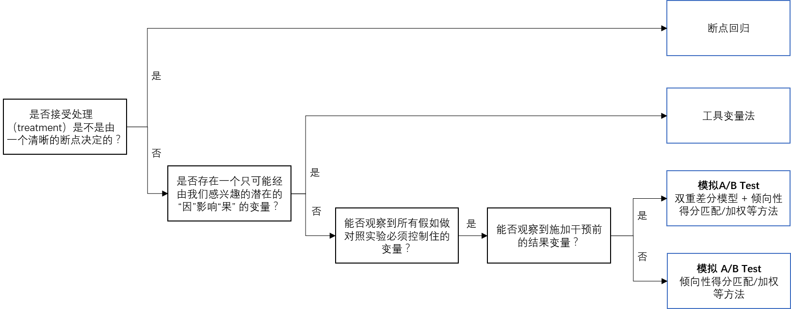

# 因果推断工具包介绍
因果推断的方法有许多，粗略来看，可以分为以下两种。
- 不做 A/B Test，利用观测数据（即历史数据）进行因果推断，这类方法成为**“观察性研究”**；
- 做 A/B Test，利用实验数据进行因果推断。

工具包主要包含“观察性研究”分析工具。

## 工具包概览
因果推断工具箱整体使用方法如下。用户将准备好的数据送进合适的工具箱后即可一键得到分析报告。

    

因果推断工具箱支持以下运行环境和数据源：

| 运行平台    | 任务类型  | 数据源   | 状态 |
| ------------- | -------- | ---- | ---- |
| 本地文件      | /     | 本地文件 | √    |
| YARD          | PySparkV2 | TDW 表   | √    |
| Tesla         | PySpark | TDW 表   | √    |
| YARD          |           | HDFS 文件   | 规划中     |
| Tesla         |          | HDFS 文件   |规划中     |
| 自建 Spark 集群 |  | SparkSQL | 规划中    |

- **本地模式**：因果推断工具箱中的方法将串行执行。
- **Spark 模式**：因果推断工具箱中的方法将并行执行，每个 Executor 上运行一个推断方法，Driver 负责收集和汇总推断结果。

## 工具包挑选

针对不同的数据，可以使用不同的因果推断方法。

- 每类方法的导航如下表
- 方法的选择方式表格下方的流程图。整体来说，示意图中位置越靠下的方法越通用，对数据的要求越低，同时也意味着能利用到的数据越少。

| 方法          | 工具使用指引导航                                             |
| ------------- | ------------------------------------------------------------ |
| 模拟 A/B Test | [“模拟 A/B Test”工具的使用方式](inference_sync_abtest.md)    |
| 工具变量法    | [维基百科](https://en.wikipedia.org/wiki/Regression_discontinuity_design) （Pending 中，欢迎 issue&MR） |
| 断点回归      | [维基百科](https://en.wikipedia.org/wiki/Regression_discontinuity_design)（Pending 中，欢迎 issue&MR） |

## 参考资料

1. [Using Causal Inference to Improve the Uber User Experience](https://eng.uber.com/causal-inference-at-uber/)