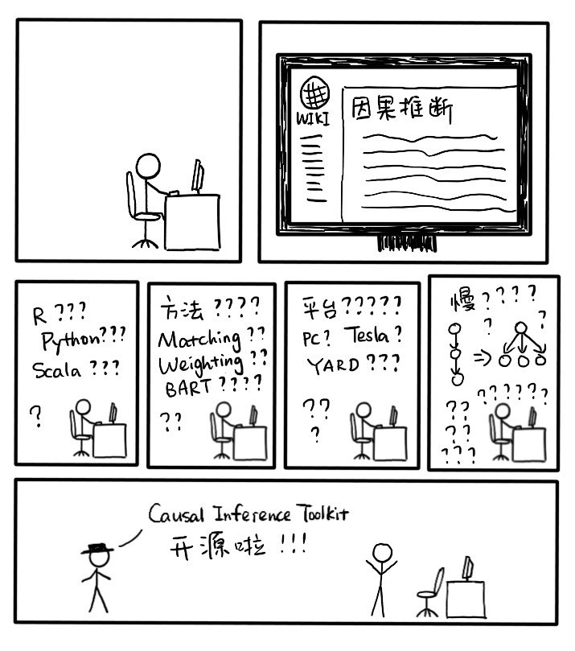

# Causal Inference Toolkit | 离线因果推断工具包

<p align="center">
    
</p>

<p align="center">
    <a href="http://orange-ci.oa.com/build/log/latest?slug=wechat-datagroup/causal_inference" target="_blank"></a>
    <a href="https://conventionalcommits.org" target="_blank"></a>
    <a href="https://git.code.oa.com/wechat-datagroup/causal_inference/blob/master/LICENSE" target="_blank"></a>
</p>

---

## 项目背景
### 为什么要做 “因果推断”？

在做用户增长时，数据分析的终极目标往往可以总结为一句话：**“如果对产品做某种改变，对业务指标会有什么影响？”** 下面是一些例子，在这些例子里，我们想要对产品做的改变是 “因”、所关注的业务指标是 “果”，分析的目标是探究 “因果效应”：

- 如果**投放红点/推送消息/气泡**，对用户的**内容消费和留存**会有什么影响？
- 如果**推荐系统的策略做某种改变**，对用户的**内容消费和留存**会有什么影响？
- 如果用户的**朋友圈有更多广告**，对用户的**朋友圈活跃度**会有什么影响？
- ……

在许多业务分析中，两个指标有相关性，并不意味着它们之间有因果关系。我们称之为 “**数据的欺骗性**”。

<p align="center">
    
</p>

用信息流推荐场景可以举出很多 “数据欺骗性” 的例子。

1. 统计发现 “用户的阅读兴趣和信息流曝光内容的重合度和用户的活跃度正相关”：这并不意味着如果推荐更多符合用户兴趣的内容，就一定能够收获更高的用户活跃度。两个指标正相关也许只是因为阅读兴趣丰富的用户天然有更高的内容消费需求，说不定给他们推什么他们都会读。
2. 统计发现 “用户当天是否收到红点 / 消息推送和用户当天的活跃度正相关”：这并不意味着红点投放给任何人都可以拉高他们的活跃度。收到红点的用户活跃度很高，也许只是因为我们恰好把红点投给了一直都很活跃的用户，说不定没有红点他们也会很活跃。
3. 统计发现 “用户某类画像的丰富程度和用户的活跃度正相关”：这并不意味着如果我们提高这类画像的覆盖率，就一定能收获更高的用户活跃度。画像丰富的用户活跃度高，也许只是因为这群用户一贯活跃度都很高因此早就累积了丰富的画像，说不定即使随机丢弃一些画像也不影响他们的活跃度。
4. ......

当我们观察到两个指标有强相关性，想进一步探究它们是否有因果关系时，有两类常用的做法。

**第一种方法是进行 A/B Test**。A/B Test 是探究因果关系的黄金准则，但是有一定的局限性，例如：

1. 成本高：需要联络各路人马实现具体的策略，耗费人力；需要足量随机流量使结果具备统计意义，耗费流量；需要持续一段时间以收集数据，耗费时间；当可做 A/B Test的选择太多时，往往难以全部尝试。

2. 可能损害用户体验：假设我们想要探究用户画像丰富度对推荐质量的影响，如果我们抹掉一些用户的画像，可能导致这些用户的推荐质量严重下滑。

3. 可能完全不可行：假设我们如果想要探究社交压力对用户发表朋友圈的意愿有什么影响，我们不可能在用户的朋友圈伪造或隐藏点赞和评论。

**第二种方法是离线分析**。这里的 “离线” 是相对于 A/B Test 的 “线上” 而言的。离线分析指的是我们希望不对线上策略做任何改变，仅仅用手边已有的数据进行分析。常用的方法是用户细分：我们首先细分、细分再细分用户，接着对每一个细分后的用户群进行分析，以期望得到更加靠谱的结果。举个例子，针对前面提到的几个信息流推荐的例子，我们可以将用户按照他们的历史活跃程度进行细拆，看看那些强相关的指标是否依然保持强相关。细分用户这种做法其实是治标不治本的：如果细分得不够细，我们依然无法得到可靠的结论；如果细分得太细，细分后的用户可能寥寥无几导致结果不具备统计意义。

考虑到 A/B Test 的局限性以及常用的离线分析方式的 “治标不治本”，我们希望利用 “离线因果推断” 这一套方法来帮助我们拨开历史数据中 “相关性” 的迷雾，看清数据背后的因果关系。

### 离线因果推断的优势

离线因果推断的优势主要有以下两点。

1. **从 “不可能” 到 “可能”**：当我们感兴趣的因果关系不能通过实验来测量时，离线因果推断提供了一种科学、有效的方法来帮助我们得到因果关系、从而更好地了解我们的用户。

2. **从 “可能” 到 “更快、更省、更聪明”**：当线上实验的选择太多 / 代价太高时，离线因果推断可以帮助我们科学地预判不同实验策略的 “前途”，让我们可以优先尝试前途更加光明的实验策略、用更少的人力、更短的时间找到产品的提升方式。

### 使用 Causal Inference Toolkit  方便快捷地 “因果推断”

从零开始做一份因果推断的门槛并不低，例如新手入门需要研究用什么语言好、用什么算法好、哪些开源工具靠谱、在公司内部的什么平台跑、如何并行化多种不同的推断算法等等。

<p align="center">
    
</p>

离线因果推断工具包封装了大量性能优异的推断方法，**极大地降低了小伙伴们的使用门槛**。小伙伴们只需准备好分析数据，即可*一键*调用大量因果推断方法、得到一份全面的因果推断分析报告。“文档手册”一节包含了具体的使用方式。

## 项目概览

```
|-- applications                # 因果推断应用
|-- benchmarks                  # 因果推断方法效果评估	
|   `-- data					
|-- causal_inference            # 源代码
|-- configs                     # 默认配置文件
|-- dependencies                # 项目依赖
|   |-- python
|   `-- r
|-- docs                        # 文档
│  └─images
|-- scripts                     # 构建、语法检查、单元测试等脚本
|-- tests                       # 单元测试
`-- setup_*.sh, ...
```

## 文档手册
- [因果推断介绍（KM文集）](http://km.oa.com/knowledge/4321)：包含因果推断介绍、因果推断方法介绍和实战经验介绍
- [工具使用文档](docs/readme.md)：关于如何挑选合适的因果推断方法完成一份因果推断数据分析的详细教程

## 谁在用
- [微信看一看](http://tapd.oa.com/wechat_datacenter/markdown_wikis/#1020362912008924045)
- [微信搜一搜](http://tapd.oa.com/wechat_datacenter/markdown_wikis/#1020362912008924045)

注：链接需要有对应业务 TAPD 权限才可访问

## 参与共建

- 如果您有任何建议或在使用过程中遇到了任何问题，欢迎提 issue
- 欢迎大家提交 Merge Request 来解决问题和贡献力量：[代码及提交规范](/docs/contribution.md)
- 如果离线因果推断工具包对你有帮助，请给它加颗星星：）

## 贡献者

万分感谢早期试用用户提出的宝贵建议！（排序不分先后）

- sterkge
- chairechen
- sherryjyli